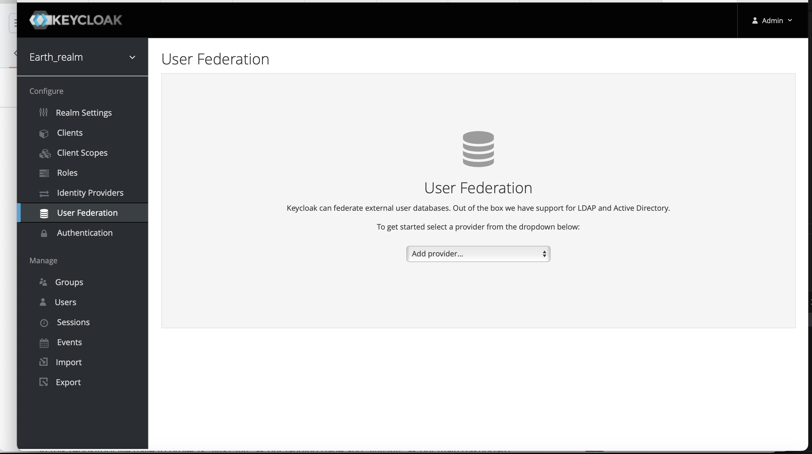
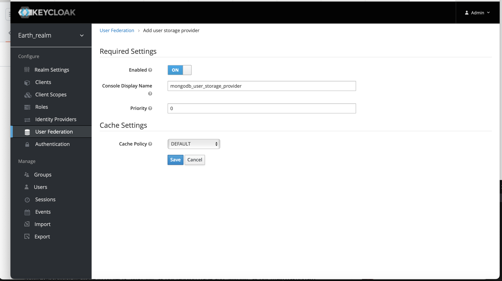
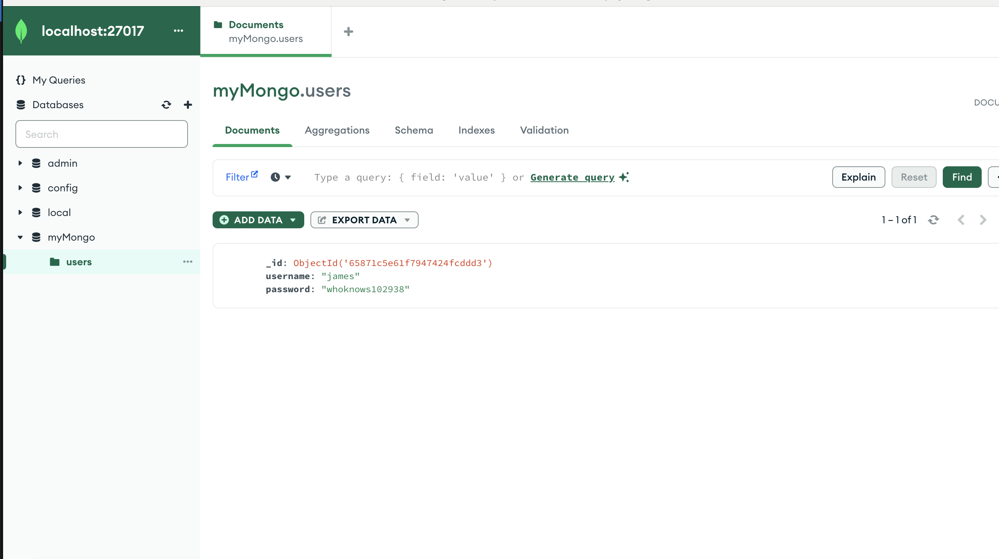
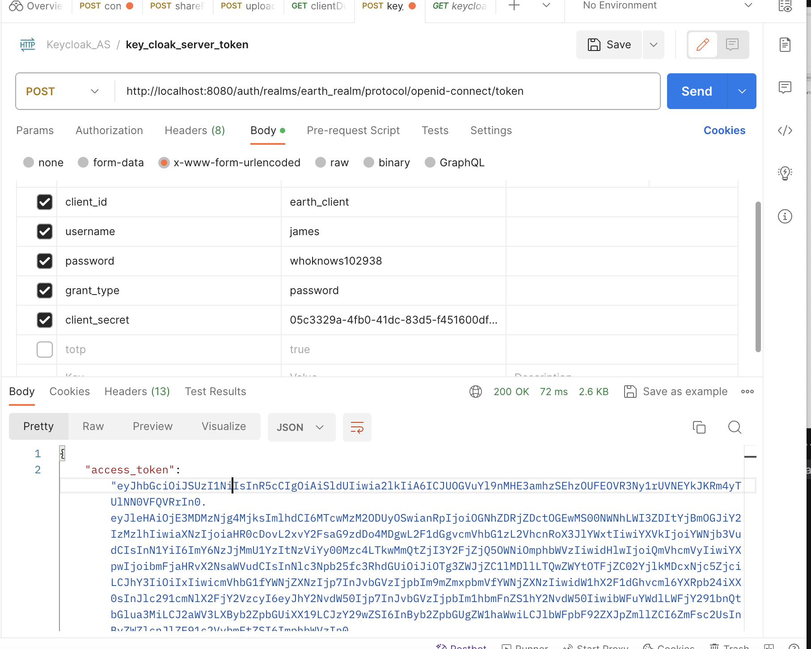

### About:
It's about a Keycloak SPI for Mongodb users federation. With this SPI you can plug in your mongodb users into Keycloak to be used in the auth flow.

### Branches:
- **main**: It contains the backbone concept but assumes that passwords are stored without hashing
- **feature/hashed-passwords-check**: This assumes that passwords are stored hashed in your mongodb

### Deployment and setup:
Start by adding your mongodb database name and connection string in the file "**application.properties**", be sure that this database is accessible by the keycloak environment

#### With Docker:
- Generate a build jar file with
```bash
./gradlew jar
```
- Build the docker image with

```bash
docker build -t keycloak_mongodb .
```

- Run docker container with

```bash
docker run -d -p 8080:8080 keycloak_mongodb 
```

- Then enable the SPI provider by following the rest of steps on Keycloak dashboard from [here](#keycloak_dashboard)

#### Without Docker:

Since we're using a third party library in this module, then besides generating the jar file we'll need to declare the used libraries as modules in keycloak modules folder.
- Go to **keycloak-installation-folder/modules/system/layers/keycloak/org**
- Copy the folder "**mongodb**" from this repo and place it in the path **keycloak-installation-folder/modules/system/layers/keycloak/org**.

Or manually: 

- create a root folder under "**mongodb**" and inside it another one "**main**"
- Download mongodb java driver jar file and put it in the folder you created before (in the main folder)
- Create a module descriptor file "**module.xml**" and insert the code below:

```xml
<?xml version="1.0" encoding="UTF-8"?>

<module name="org.mongodb" xmlns="urn:jboss:module:1.3">
    <properties>
        <property name="jboss.api" value="private"/>
    </properties>

    <resources>
        <resource-root path="mongo-java-driver-3.12.14.jar"/>
    </resources>

    <dependencies>
        <module name="javax.api"/>
        <module name="org.apache.log4j"/>
    </dependencies>
</module>

```

- Now, generate your jar file and put it in the keycloak deployment folder "keycloak/standalone/deployments", if everything goes right it should generate a file with the extension .deployed

- <div id="keycloak_dashboard">Then go to Keycloak dashboard to enable your provider, go to "User Federation" from the menu on the left as in the picture as below</div>



And select your provider from the providers dropdown


It will redirect you to the provider settings, leave it all default and click "save"



Now as you confirmed, you can go and test, I've a dummy mongodb with a dummy user data



Let's test that with Postman




### Note:
Be sure that your mongodb is accessible by the keycloak server especially if you're using Docker.

### Contribution:
All contributions are most welcome, feel free to clone this repo and add your PR.